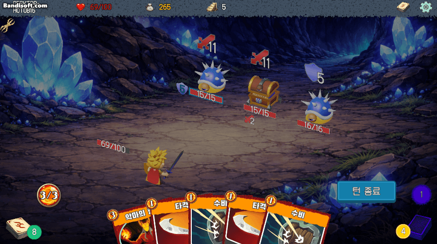
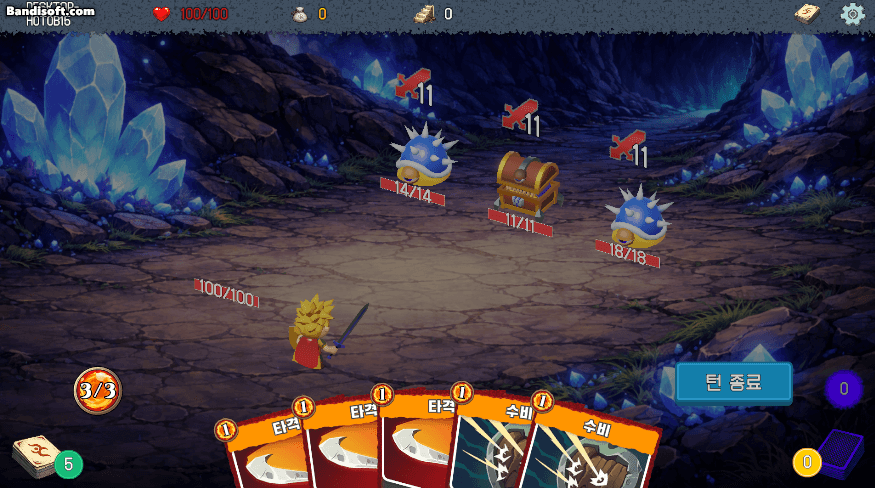
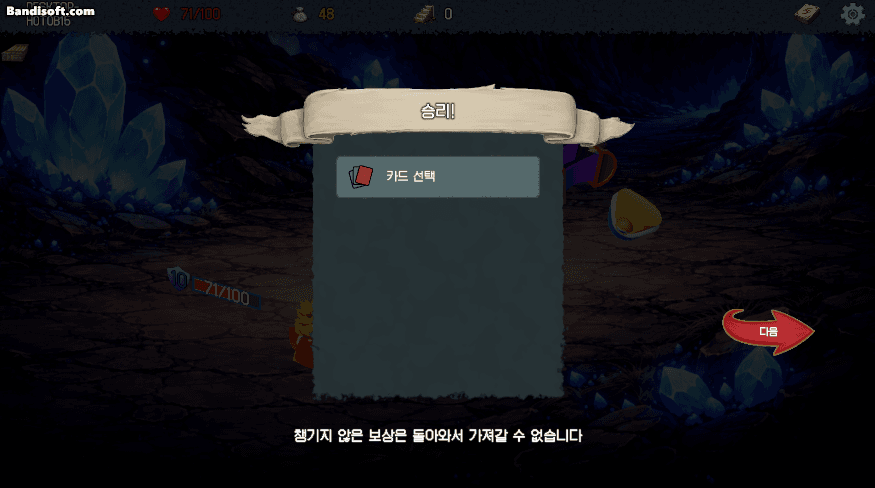
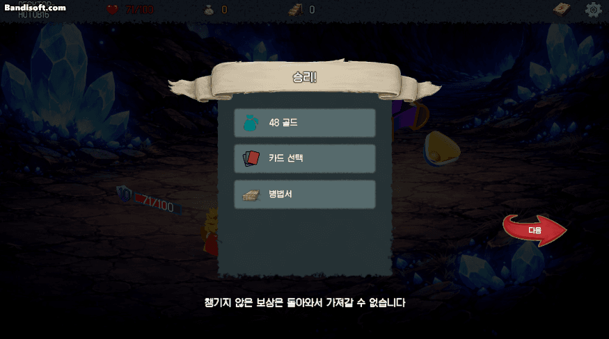
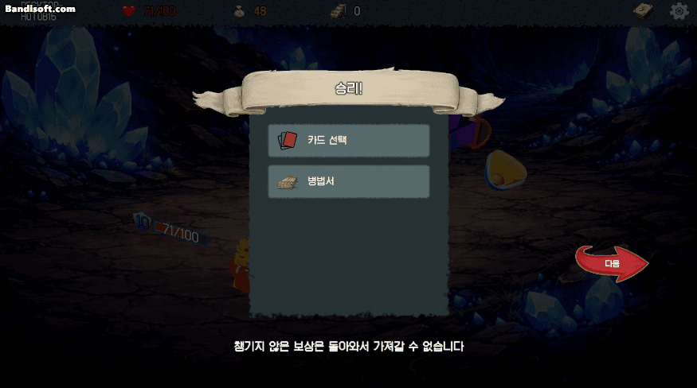
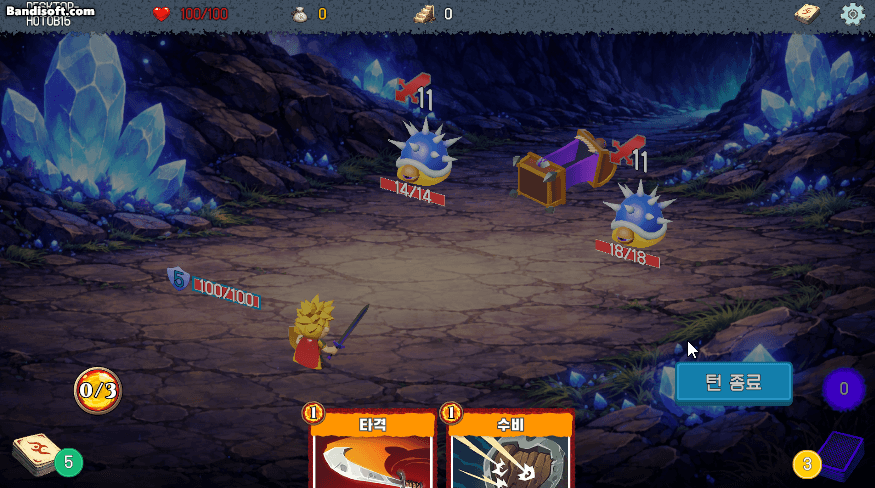
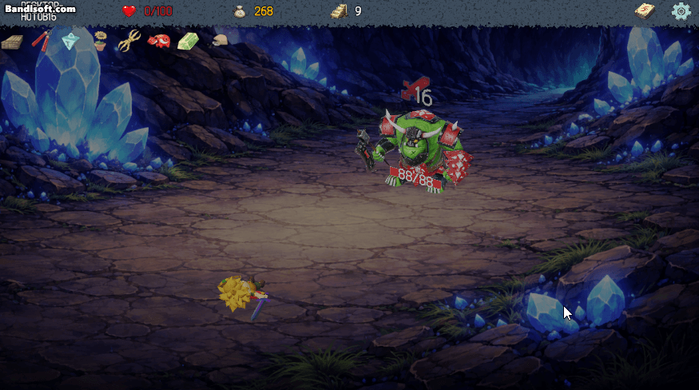

# Preview

## ⚔ 전투

### 전투 시작
  
### 공격 카드 사용 + 타겟팅
  
└ 효과: 피해를 6 줍니다.
### 스킬 카드 사용 (방패)
.gif)  
└ 효과: 방어도를 5 얻습니다.
### 스킬 카드 사용 (디버프) + 카드 소멸
.gif)  
└ 효과: 적 전체에게 약화와 취약을 3 부여합니다.  
└ 소멸: 사용 후 카드 더미로 날아가지 않고 디졸브.
### 파워 카드 사용
  
└ 효과: 턴 종료시 체력을 1 잃고 적 전체에게 피해를 5 줍니다.
### 몬스터 사망
  
### 카드 보상 획득
  
### 골드 보상 획득
  
└ 상단 메뉴 골드 UI 업데이트
### 유물 보상 획득
  
└ 상단 메뉴 아래 유물 UI 업데이트
### 턴 전환
  
### 전투 패배
  
└ 전투 중 발생하는 이벤트들의 횟수를 기록하여 출력

## ☕ 휴식

### 체력 회복
  
### 카드 강화
  

## 💎 유물방
  

## 🗺 지도
  
