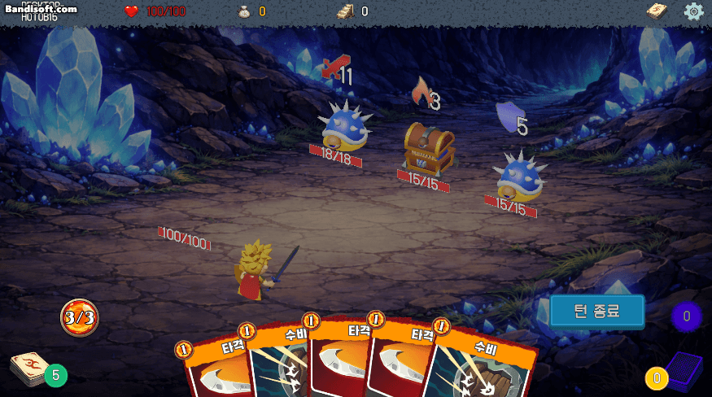
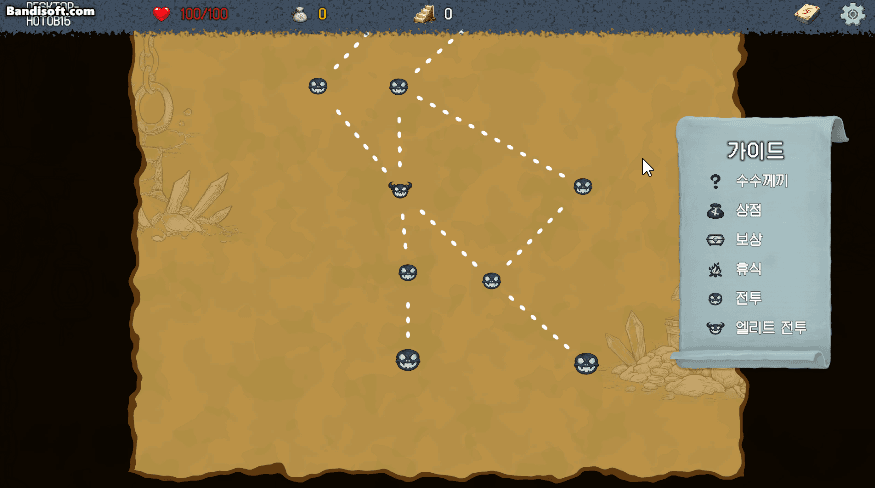
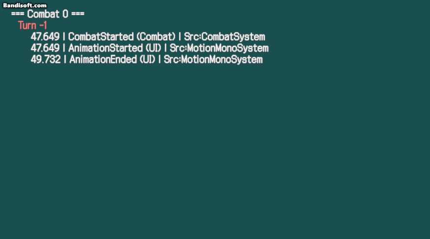
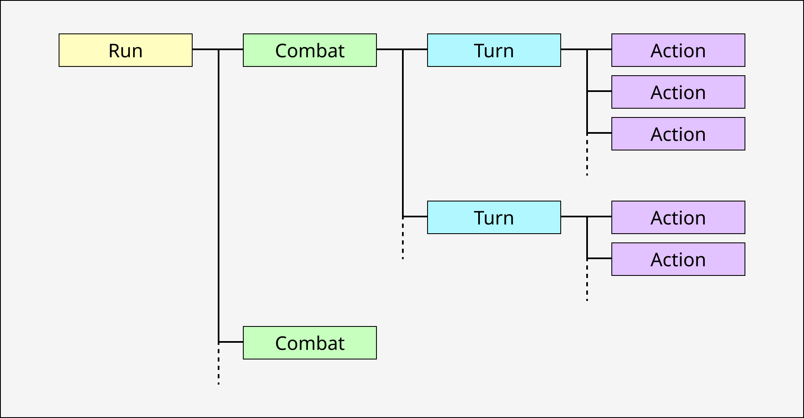
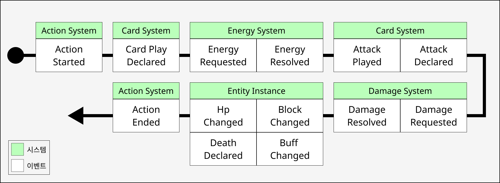
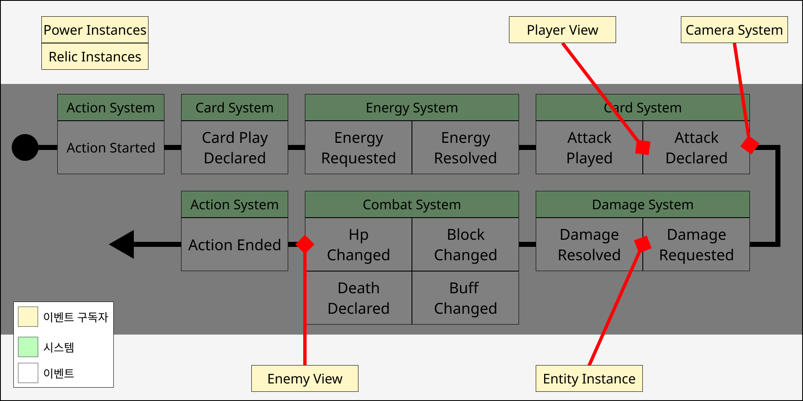

# fate-of-the-faint
EventBus 기반 아키텍처로 구현한 Slay the Spire 스타일의 덱빌딩 로그라이크 게임입니다.  
전투 시스템을 이벤트 기반으로 설계하여 카드, 버프, 유물 시스템 간 결합도를 낮추었습니다.  
카드 기반 턴제 전투와 덱 빌딩, 유물 시스템을 중심으로 설계되었습니다.  

[빌드파일 다운로드(Windows)](https://github.com/Seok-Min-Lee/fate-of-the-faint/releases/tag/Demo)  
## 🎮 게임 프리뷰
### Attack Card Play
  

### Map
  

### Debug Console
  

[더 보기](Docs/Preview.md)  

## ✨ 기술
### EventBus
- 시스템 간 결합도를 낮추기 위해 **EventBus** 패턴을 사용했습니다.  
- `Run` → `Combat` → `Turn` → `Action` 단위로 게임 진행을 구조화했습니다.  
- Damage, Energy와 같이 계산이 필요한 경우 `Requested` → `Resolved` 단계로 나누어 버프, 유물, 파워 등 개입할 수 있도록 설계했습니다.  
### Data / Instance / View 
- 데이터 정의, 런타임 상태, 표현 계층을 분리했습니다.  
### DAG (Directed Acyclic Graph)
- **방향성 비순환 그래프** 방식을 활용하여 랜덤한 맵을 생성합니다.  
### Debug Console
- 전투 중 발생하는 이벤트 흐름을 추적하기 위한 디버그 콘솔을 구현했습니다.  

# Architecture
## 🔄 Gameplay Flow Architecture
게임 진행의 흐름을 **Run, Combat, Turn, Action** 구조로 분리하여 설계했습니다.  

  

| 용어 | 설명 |
|-----|-------------|
| Run | 게임을 시작하여 클리어하거나 패배할 때까지 이어지는 **하나의 플레이 세션** |
| Combat | Run 중 발생하는 **개별 전투 단위** |
| Turn | Combat 안에서 플레이어와 적이 번갈아 행동하는 **행동 단계** |
| Action | Turn 안에서 실행되는 **개별 게임 이벤트 단위** (카드 사용, 턴 종료 등) |

## 🧩 Data Architecture
게임 데이터를 **Data, Instance, View** 구조로 분리하여 설계했습니다.  
이를 통해 데이터 정의, 런타임 상태 및 로직, 표현 계층을 독립적으로 관리할 수 있습니다.  

| 구분 | 타입 | 설명 |
|------|------|---------------|
| Data | ScriptableObject | 카드, 유물, 파워 등의 **정적 데이터 정의** |
| Instance | C# Script | Combat 또는 Run 단위로 생성되어 **게임 로직과 상태를 처리** |
| View | Monobehavior | Instance 상태를 기반으로 **애니메이션 및 UI 표현** |

## 🏗 System Architecture
**이벤트 기반 아키텍처(EventBus)** 를 사용하여 시스템 간 결합도를 낮추도록 설계했습니다.  
각 시스템은 EventBus를 통해 상호작용합니다.  

### Overview
| 게임 흐름 | 전투 로직 | 콘텐츠 | 플레이어 리소스 | 연출 | 기타 |
|---|---|---|---|---|---|
| CombatSystem | EnergySystem | CardSystem | GoldSystem | UISystem | Debug System |
| TurnSystem | DamageSystem | PowerSystem | RecordSystem | CameraSystem |
| ActionSystem | BuffSystem | RelicSystem |  | MotionSystem |

### 게임 흐름
- 전투의 **전체 진행 흐름**을 제어하는 시스템입니다.  

| 시스템 | 역할 |
|---|---|
| CombatSystem | 전투 시작 및 종료를 관리 |
| TurnSystem | 플레이어 턴과 적 턴의 진행을 관리 |
| ActionSystem | 턴 내에서 발생하는 행동의 실행을 관리 |

### 전투 로직
- 전투에서 적용되는 **핵심 규칙과 계산 로직**을 담당합니다.  

| 시스템 | 역할 |
|---|---|
| EnergySystem | 카드 사용에 필요한 에너지 관리 |
| DamageSystem | 공격 피해 계산 및 적용 |
| BuffSystem | 버프/디버프 계산 및 적용 |

### 콘텐츠
- 플레이어가 전투에서 사용하는 **콘텐츠 요소**를 관리합니다.  

| 시스템 | 역할 |
|---|---|
| CardSystem | 카드 데이터 및 카드 사용 로직 |
| PowerSystem | 지속적으로 적용되는 파워 효과 |
| RelicSystem | 유물 효과 및 전투 보너스 |

### 플레이어 리소스
- 전투 외적인 **플레이어 자원 및 기록**을 관리합니다.  

| 시스템 | 역할 |
|---|---|
| GoldSystem | 골드 획득 및 사용 |
| RecordSystem | 전투 및 플레이 통계 기록 |

### 연출
- 게임 로직과 분리된 **표현 계층**입니다.  

| 시스템 | 역할 |
|---|---|
| UISystem | UI 업데이트 및 표시 |
| CameraSystem | 카메라 이동 및 연출 |
| MotionSystem | 애니메이션 및 모션 처리 |

## 👀 예시 (Attack Card Action Flow)
공격 카드를 사용할 때 발생하는 **이벤트 기반 처리 흐름 예시**입니다.  

### Event Publication
- 각 시스템은 **EventBus**를 통해 이벤트를 구독하고 필요한 연산에 개입합니다.  
- 이를 통해 게임 로직과 표현을 분리하면서도 시스템 간 결합도를 낮게 유지합니다.  

| 이벤트 | 설명 |
|---|---|
| Action Started | `ActionSystem`이 새로운 액션의 시작을 알립니다. 이후 발생하는 모든 연산은 해당 `Action Context` 내에서 처리됩니다. |
| Card Play Declared | `CardSystem`이 카드 사용 의도를 선언합니다. 카드 사용 가능 여부를 검증하고 카드 플레이 흐름을 시작합니다. |
| Energy Requested | `EnergySystem`이 카드 사용에 필요한 에너지 연산을 요청합니다. 유물, 버프, 파워 등 에너지 변화에 영향을 주는 요소들이 이 이벤트를 구독하여 수정값을 제공합니다. |
| Energy Resolved | 모든 에너지 수정 연산이 적용된 후 최종 에너지 소모 값이 결정됩니다. `EnergySystem`이 플레이어의 에너지를 차감합니다. |
| Attack Played | 공격 카드가 실제로 플레이되었음을 선언합니다. 카드 애니메이션 및 후속 효과의 트리거로 사용됩니다. |
| Attack Declared | 카드의 Attack 효과가 발동되었음을 선언합니다. 공격 대상 및 기본 공격 수치가 설정됩니다. |
| Damage Requested | `DamageSystem`이 데미지 계산을 요청합니다. 버프, 디버프, 유물, 파워 등의 효과가 이 이벤트를 구독하여 데미지 값을 수정합니다. |
| Damage Resolved | 모든 데미지 수정 연산이 적용된 후 최종 데미지 값이 결정됩니다. |
| Hp / Block / Buff Changed | 최종 데미지를 적용하여 관련된 `Entity Instance`의 `Block`, `Hp`, `Buff` 변화를 처리합니다. |
| Death Declared | `Hp`가 0 이하가 된 경우 해당 `Entity Instance`의 사망 이벤트를 선언합니다. 이후 사망 처리 및 전투 종료 조건이 평가됩니다. |
| Action Ended | `ActionSystem`이 현재 액션의 종료를 알립니다. 후속 액션 또는 다음 턴 진행이 가능해집니다. |

### Event Subscription
- 공격 카드 플레이 과정에서 다양한 **System, Instance, View가 이벤트를 구독하여 동작합니다.**  
- 이벤트 기반 구조를 사용하여 **게임 로직(Instance)과 표현(View)을 분리**했습니다.  

  

| 개체 | 구독 이벤트 | 처리 |
|---|---|---|
| Player View | AttackPlayed | 플레이어 공격 애니메이션 재생 |
| Camera System | AttackDeclared | 공격 연출을 위한 카메라 모션 실행 |
| Entity Instance | DamageRequested | 공격자 / 피격자 인스턴스 제어 및 전투 상태 처리 |
| Enemy View | HpChanged / BuffChanged / BlockChanged | 캐릭터 모션 재생 및 상태 UI 업데이트 |
| Power Instances | Various Events | 파워 효과에 따라 이벤트 개입 및 효과 적용 |
| Relic Instances | Various Events | 유물 효과에 따라 이벤트 개입 및 수치 변경 |
